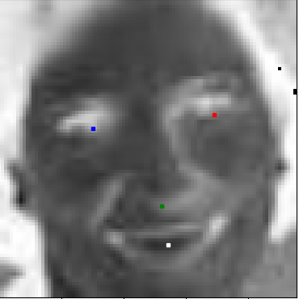
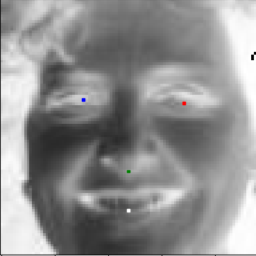

# Smile

Smile is a facial recognition software that is used to determine a person's key features. 
This project is heavily based off of using the concept of localization.

**Localization:** Determining the location of specific features of interest, given an image.

Smile is currently able to detect a person's eyes, nose, and mouth, with a high degree of accuracy, regardless of orientation.

---

## Machine Learning

### Overview

The ML concepts that I was able to explore in building this project include:

- [x] Localization
- [x] Transfer Learning

**Localization**

* The idea of localization is very intuitive - it uses neural networks to perform regression, rather than classification. 
Instead of using 1-hot-encoded vectors (ex: [1, 0, 0, 0]) for classification, the network is trained to produce an output vector
with each element corresponding to a specific location on a plane through coordinates (ex: [100.4, 50.3, 31.234, 1.052]). 

* One of the first challenges I faced with localization was how difficult it was to train the network to accurately predict the 
coordinates of facial features. Because the given coordinates were between 0 and 96 (My dataset was composed of 96 x 96 images),
the activation function in the final layer of my network was *Relu* (Rectified Linear), which maps all positive inputs to the themselves
and all negative inputs to 0. This wasn't the best approach as it made training very slow and I wasn't sure that the network would
converge to a local minimum. 

* I was able to solve this by mapping each of the coordinates in my training set to be between 0.0 and 1.0, by multiplying each coordinate
by a factor of (1.0/96.0 =~ 0.0104). From there on out, it was a matter of changing the activation function in my network's last layer
to the *Sigmoid* activation function, which conveniently has a codomain between 0.0 and 1.0. With this new implementation, the optimization 
problem at hand did not change, but the network's performance drastically improved. 

**Transfer Learning**

* Transfer learning is very beneficial when training networks on large amounts of data - it leverages a pre-trained network, using the 
features that the pre-trained network is aware of for feature extraction (detecting entities that the pre-trained network is good at), allowing for speedy training.

* I decided to use the *VGG19* network as my base model, pre-trained on the *ImageNet* dataset which consists of over 1 million images. 
I then added custom trainable layers connecting to the base model to leverage it for feature extraction. The results I got from this were unexpected,
as my network's performance was relatively poor and during training, the loss seemed to stagnate and not decrease. After experimenting with using less
and less layers of the *VGG19* model, I saw that my results improved, but not by far.

* My conclusion is that these results are due to overfitting - the network was trained on a dataset consisting of images with high pixel densities,
which were not applicable to my dataset which was bounded to images that were 96 x 96 pixels. I resorted to using a custom neural network, and was
easily able to achieve a validatoin loss of just under 0.01, in less than 60 epochs.

**Miscellaneous**

The loss function that I decided to go with in this implementation was *Mean Squared Error*. Although a very basic cost function, 
it yielded great results (I suspect because I had turned this problem into a regression, from the typical use of classificatoin)! 

### Stack

This project is built with Python, Tensorflow-GPU, and multiple popularized Python libraries.

### Demo

Here is a live demonstration of my ML model processing images through my webcam:

[)](https://www.youtube.com/watch?v=f1XyNzHjqIA)

As we can see, there are some inconsistencies. It performs well only when my network's images are centered
in a specific location. This is largely due to the fact that my training and test data all contained
the faces of individuals in a particular location. This, I believe, can be solved by performing data augmentation for shifting, rather than only using rotations.

### Sample Images

Here are some images that showcase my trained model's performance:

**NOTE** : The colors of the facial feature detections are correspondent to the following map:

* Blue -> Left Eye 
* Red -> Right Eye 
* Green -> Nose 
* White -> Mouth

*Let's look at the performance on pixelated, hard-to-recognize image!*

*We can even accurately detect landmarks on a baby!*

Feel free to explore the assets folder for more image samples.

---

## Directory

There are various `.py` files introduced in this project, and are separated to introduce modularity and clarity of code.

* `app.py` : This is the application's entrypoint. The user can choose to run `python app.py train` to train the neural network, or they can use `python app.py test` to test the network's capabilities on various test images.

* `img_reader.py` : This helper class is used to read images from a `.npz` file containing **numpy** representations of images. There are a total of 7049 images containerized in said `.npz` file.

* `csv_reader.py` : This helper class is used to read in landmark coordinates from a `.csv`, using the popular library **pandas**. There are 7049 rows of data corresponding to each image.

* `net.py` : This file contains a sandbox environment where I played around with different neural network architectures to achieve the best/highest accuracy results.

* `training.py` : This file contains helper methods used to train the neural network in a packaged manner.

* `prediction.py` : This file contains helper methods to use the neural network saved in an `.h5` format for predictive purposes.

* `loader.py` : This utility class adds a layer of abstraction for loading training data from their stored `.npy` format.

* `drawer.py` : This utility class provides method to display images and plot respective points corresponding to facial features on said images.